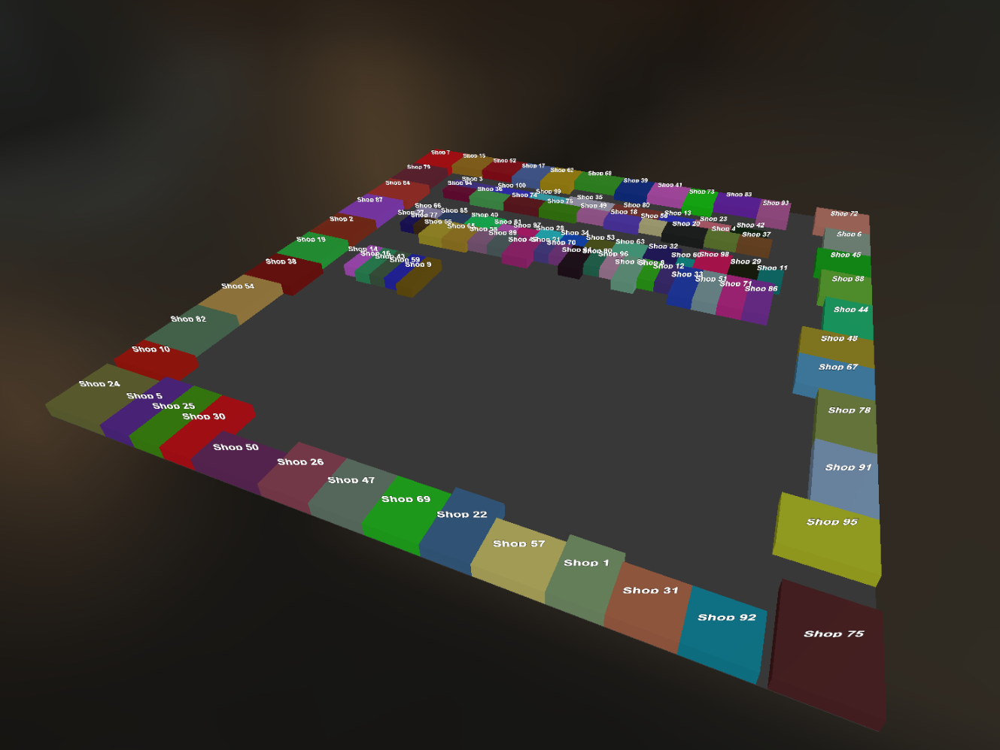

3D‑визуализатор сцены на базе Three.js с поддержкой интерактивного взаимодействия и переключения режимов просмотра (2D/3D). 

Система оптимизирована для работы с большим количеством объектов за счёт техник инстансинга и пакетного рендеринга.

## Инструкция по запуску
```bash
npm install
npm run start

Откройте в браузере: http://localhost:9000
```

Можно менять количество и размер объектов, размер сцены в файле config.js
```bash
dataCount: 100,
minBoxWidth: 3,
maxBoxWidth: 10,
minBoxDepth: 3,
maxBoxDepth: 10,
width: 100,
depth: 100
```

## Скриншот приложения


## Описание архитектуры
SceneManager (оркестратор) - отвечает за инициализацию и управление жизненным циклом сцены.

SceneModel (модель данных) - хранит состояние сцены: камеры, источники света, объекты

SceneView (визуализация и взаимодействие) - отвечает за отображение сцены и обработку пользовательского ввода

InstancedBoxRenderer — оптимизированный рендерер для множества боксов

TextBatchRenderer — рендерер текстовых подписей

## Алгоритм размещения объектов
1. Объекты сортируются по убыванию площади. Крупнейшие размещаются первыми по углам
2. Оставшиеся объекты размещаются вдоль периметра пола (слева, справа, сверху, снизу), если их размеры вписываются в свободное пространство соответствующей стороны
3. После размещения у стен определяется внутренняя область (центр) — пространство между заполненными сторонами.
Из этой области вычитается ширина проходных дорожек (FLOOR.loopRouteWidth) — формируется финальная зона для центрального размещения
4. Объекты размещаются рядами внутри центрального периметра. Если в текущем ряду не хватает места для объекта, начинается новый ряд ниже. Поддерживаются два ряда на уровень
5. (для теста) Объекты, которые не удалось разместить в основной зоне, выводятся за пределы пола в виде сетки

## Оптимизация
1. Объединить все текстовые текстуры в один атлас. Можно формировать этот атлас динамически. Создайть один большой меш с UV‑координатами, указывающими на нужные участки атласа
2. Реализовать LOD. На большом расстоянии от камеры скрывайте текст. Использовать Mip-mapping
3. Учитывать frustum камеры
4. Для обработтки кликов по объектам использовать Instance ID
5. Для быстрого поиска объектов использовать Map по id. Если по координатам - Spatial Grid или KD-Tree